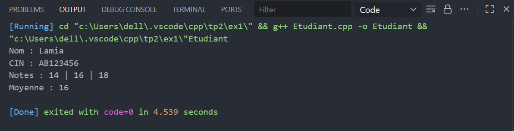
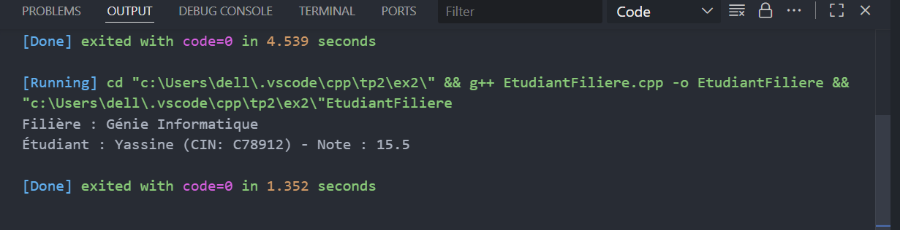

# TP : Programmation Orientée Objet en C++

## Exercice 1 & 2 — Gestion d’Étudiant et Association Filière

---

### Objectif pédagogique  
Ces exercices visent à renforcer la compréhension des **classes**, **méthodes membres**, **modificateurs d’accès**, **encapsulation** et la **relation entre objets** en **C++** à travers deux cas concrets.

---

## Exercice 1 : Gestion d’un Étudiant

### Description  
Cet exercice consiste à créer une classe **Etudiant** qui modélise un étudiant avec un **nom**, un **CIN**, et trois **notes**.  
Le programme permet de calculer la moyenne des notes et d’afficher toutes les informations de l’étudiant.

---

### Fonctionnalités  
- Encapsulation des attributs : nom, CIN, note1, note2, note3.  
- Accesseurs (get) et modificateurs (set) pour chaque attribut.  
- Calcul automatique de la moyenne des trois notes.  
- Affichage complet des informations de l’étudiant.

---

### Résultat  
Nom : Lamia  
CIN : AB123456  
Notes : 14 | 16 | 18  
Moyenne : 16  

---

## Exercice 2 : Association Étudiant et Filière

### Description  
Ce programme modélise une relation d’association 1 à 1 entre une classe **Filiere** et une classe **Etudiant**.  
La classe **Filiere** contient le nom de la filière et un étudiant inscrit.

---

### Fonctionnalités  
- Classe **Etudiant** avec nom, CIN et note.  
- Classe **Filiere** avec nom de la filière et un objet Étudiant.  
- Méthodes pour affecter un étudiant à une filière.  
- Affichage des informations de la filière et de l’étudiant inscrit.

---

### Résultat  
Filière : Génie Informatique  
Étudiant : Yassine (CIN: C78912) - Note : 15.5  

---

### Auteur  
**Hamza Idhssaine**  
Étudiant à l’École Normale Supérieure de Marrakech — Département Informatique
